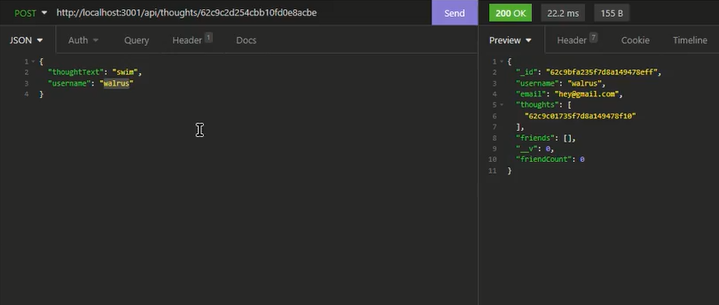

# Mongo Space
## Description

This project is a functional backend for a basic social media site, where users are able to add other users as friends, share thoughts, and react to thoughts. It was constructed using MongoDB and NodeJS.

## Table of Contents

- [Installation](#installation)
- [Usage](#usage)
- [License](#license)
- [Contributing](#contributing)
- [Questions](#questions)

## Installation

1. Make sure you have downloaded and installed [node.js](https://nodejs.org/en/download/) and [MongoDB](https://www.mongodb.com/)
2. Download a .zip of this repository, or clone the repository into a new directory using Git.
3. Open a terminal window in the location of the extracted or cloned files and run ```node install``` to ensure the necessary packages will be included. You should see a new folder called "node_modules" appear in the directory.

## Usage

1. Once the node packages have been installed, type ```npm start``` into your terminal to run the server. Now the API can be accessed via various routes on http://localhost:3001:

* http://localhost:3001/api/users - get all users, create a user
* http://localhost:3001/api/users/:id - get a user by id, update/delete a user
* http://localhost:3001/api/users/:id/friends/:friendId - add/remove a user from another user's friend list
* http://localhost:3001/api/thoughts - get all thoughts
* http://localhost:3001/api/thoughts/:thoughtId - get a thought by id, update a thought
* http://localhost:3001/api/thoughts/:userId - create a thought
* http://localhost:3001/api/thoughts/:userId/:thoughtId - delete a thought
* http://localhost:3001/api/thoughts/:thoughtId/reactions - add a reaction
* http://localhost:3001/api/thoughts/:thoughtId/reactions/:reactionId - delete a reaction


Watch a brief video demonstrating how to use the above routes:

[](https://drive.google.com/file/d/1BPubhIsfskMKKGQFsyYUjF1y4hs5kcAw/view)

## License

[](https://opensource.org/licenses/MIT)

## Contributing

* Professional readme template generated using [https://github.com/chardmuffin/readme-generator-rth](https://github.com/chardmuffin/readme-generator-rth)
* Uses [Mongoose](https://www.npmjs.com/package/mongoose) package for MongoDB object modeling tool
* Uses the [express.js](https://www.npmjs.com/package/express) framework

## Questions

I am on GitHub: [https://github.com/chardmuffin](https://github.com/chardmuffin)

I can also be reached by email at [richardhuffman96@gmail.com](mailto:richardhuffman96@gmail.com)